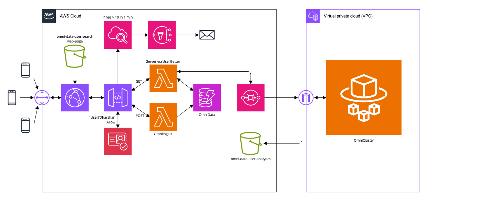

# OmniData: Serverless Event-Driven Microservices on AWS
## Objective
This project demonstrates a decoupled, hybrid cloud architecture that combines **Serverless** efficiency with **Containerized** power. The goal was to build a user management system capable of handling real-time REST API requests (Synchronous) while offloading heavy analytics tasks to background workers (Asynchronous) to ensure zero latency for the user.

## 💡 Architectural Design Note

**Hybrid Compute Approach:**
While a pure Serverless approach (Lambda only) is common, this architecture deliberately integrates **AWS ECS (Fargate)** to demonstrate a realistic enterprise pattern: using Containers for long-running, compute-intensive background tasks that might exceed Lambda's 15-minute timeout limits. This hybrid design proves the ability to seamlessly bridge the gap between Serverless functions and Container orchestration within a Virtual Private Cloud (VPC).

## 🛠️ Tech Stack & Services
* **Frontend:** Amazon S3 (Static Hosting), Amazon CloudFront (Global CDN & HTTPS)
* **Authentication:** Amazon Cognito (OIDC User Pools & OAuth Tokens)
* **API Layer:** API Gateway (REST API with Usage Plans & Throttling)
* **Compute (Serverless):** AWS Lambda (Python 3.x) for real-time logic
* **Compute (Containers):** AWS ECS Fargate, Amazon ECR (Docker Registry)
* **Messaging (Decoupling):** Amazon SQS (Simple Queue Service)
* **Database:** Amazon DynamoDB (NoSQL)
* **Monitoring:** CloudWatch Alarms, X-Ray Tracing, Amazon SNS (Alerting)

## 🏗️ Implementation Steps

### Phase 1: The Serverless Core
* Provisioned a **DynamoDB** table (`OmniData`) for sub-millisecond data retrieval.
* Developed Python Lambda functions (`OmniIngest`, `ServerlessUserGetter`) to handle CRUD operations.
* **Result:** A functioning backend that could read/write data directly.

### Phase 2: API & Security Layer
* Configured **API Gateway** to expose Lambda functions via REST endpoints.
* Implemented **API Keys** and **Usage Plans** to throttle request rates.
* Integrated **CloudWatch Alarms** and **SNS** to trigger email alerts if traffic exceeds thresholds (e.g., >10 requests/min).
* Enabled **X-Ray** to trace latency bottlenecks across the request lifecycle.

### Phase 3: The Frontend & Edge Security
* Deployed a static `index.html` interface to **Amazon S3**.
* Secured the bucket using **Amazon CloudFront** (OAI) to enforce HTTPS and cache content globally.
* Integrated **Amazon Cognito** to protect the API. Only authenticated users with a valid JWT Token can submit `POST` requests.

### Phase 4: Asynchronous Decoupling (The "Heavy Lifting")
* Created an **SQS Queue** to act as a buffer between the API and the Analytics engine.
* Modified the "Getter" Lambda to split traffic:
    1. Return data to the user immediately (Synchronous).
    2. Silently push a message to SQS for logging (Asynchronous).

### Phase 5: Containerized Worker (ECS Fargate)
* Developed a Python worker script (`worker.py`) to poll SQS, process messages, and archive logs to a separate S3 Analytics bucket.
* Dockerized the application and pushed the image to **Amazon ECR**.
* Deployed the container on **AWS ECS Fargate** inside a private VPC, configuring auto-assigned public IPs to allow outbound polling to SQS.

## 🧪 Testing & Verification
To verify the decoupled architecture, I performed the following tests:

1.  **Synchronous Speed Test:**
    * Performed a User Search on the frontend.
    * **Result:** Data appeared instantly (Status 200 OK) because the API didn't wait for analytics processing.
2.  **Asynchronous Logic Test:**
    * Checked the **SQS Queue** to see the message count increase.
    * Watched the **ECS Fargate** logs in CloudWatch to confirm the worker "woke up," processed the message, and deleted it from the queue.
3.  **Security Test:**
    * Attempted to `POST` a new user without logging in.
    * **Result:** API Gateway rejected the request with `401 Unauthorized`.

## 🚧 Challenges Faced
**Issue: "Missing Authentication Token" on CORS Pre-flight**
* **Problem:** The browser returned a `403 Forbidden` error on the `OPTIONS` request, even though CORS was enabled.
* **Diagnosis:** API Gateway changes were made but not **Deployed** to the `Dev` stage. Also, the `OPTIONS` method was accidentally requiring an API Key.
* **Solution:** Removed Auth requirements for `OPTIONS` and redeployed the API.

## 🚀 Future Improvements
* **Infrastructure as Code:** Migrate the manual console setup to **Terraform** for reproducible deployments.
* **CI/CD Pipeline:** Use **AWS CodePipeline** to automatically build and push the Docker image to ECR whenever the Python code changes.
* **Dashboarding:** Connect **Amazon QuickSight** to the S3 Analytics bucket to visualize user search trends.
